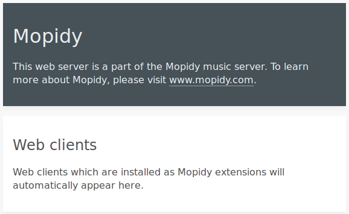

## Origin

* https://wiki.ecohackerfarm.org/tutorials:it:soundsystem:server_setup#install_the_moped_web_interface_to_mopidy

## References

* https://github.com/skalavala/Multi-Room-Audio-Centralized-Audio-for-Home

### Ansible

* https://github.com/rhietala/raspberry-ansible
* http://www.hietala.org/automating-raspberry-pi-setup-with-ansible.html
* http://www.hietala.org/multi-room-audio-with-mpd-and-snapcast.html

### Iris

* https://github.com/jaedb/Iris/wiki/Getting-started

### Mopidy

* https://www.mopidy.com/
* https://pyspotify.mopidy.com/en/latest/installation/#debian-ubuntu-install-from-apt-mopidy-com

### Mopidy-Local-SQLite

* https://github.com/mopidy/mopidy-local-sqlite

### Mopidy-local-images

* https://github.com/mopidy/mopidy-local-images

### mpd

* https://github.com/liamw9534/mopidy-pulseaudio
* https://feeding.cloud.geek.nz/posts/home-music-server-with-mpd/

### Pulseaudio

* https://freedompenguin.com/articles/how-to/pulseaudio-toilet-full-roses/
* https://github.com/Malte-D/rpi-mopidy-pulseaudio-server/blob/master/Dockerfile

### Raspberry Pi

* http://www.pimusicbox.com/

### Snapcast

* https://github.com/badaix/snapcast

### Shoutcast (winamp)

* https://www.linode.com/docs/applications/media-servers/how-to-install-shoutcast-dnas-server-on-linux/

## Spotify

* [https://github.com/mopidy/mopidy-](https://github.com/mopidy/mopidy-spotify)
* https://www.mopidy.com/authenticate/

### youtube

* https://github.com/mopidy/mopidy-youtube
* 

# Server setup

## Initial config

### ufw

```shell
ufw allow ssh
ufw enable
ufw status
```

### openssh-server

```shell
apt update
apt install openssh-server
```

### update upgrade

Connect from client

```shell 
sudo su -
apt update
apt upgrade
```

### ssh config

```shell
nano /etc/ssh/sshd_config
```

Options, you may need to add more depending on your distribution

```shell
PermitRootLogin no
ChallengeResponseAuthentication no
```


 This HowTo is about setting up the audio server on Ubuntu and  RaspberryPi. The instructions are mainly for Ubuntu and notes for RPi  are added where applicable. 

## 1. Ensure for Avahi

 Avahi advertises services over network and Snapcast needs it. Run this as a sudoer. 

```shell
ps aux | grep avahi | grep -v grep || sudo apt-get install -y avahi-daemon
```

## 2. Ensure for Mopidy

 **\*RPi:** Mopidy on RPi needs manual install for the  latest version. Dependencies may also differ (eg. GStreamer 1.0 not  0.10). These should get installed automatically from the new Mopidy  repository added to the local list. Follow these instructions: https://docs.mopidy.com/en/latest/installation/debian/#debian-install.*  

```shell
sudo apt-get install -y mopidy       # causes a server to install a lot of stuff
sudo apt-get install -y mopidy-doc
```

## 3. Configure Mopidy for HTTP access and Snapcast integration

 When Mopidy runs as a service in the default single-zone mode, the main config file is `/etc/mopidy/mopidy.conf`. 

Backup `/etc/mopidy/mopidy.conf `

```shell
cp /etc/mopidy/mopidy.conf /etc/mopidy/mopidy.conf_orig
```

Take a look at all of Mopidy's configuration setting

```shell
sudo mopidyctl config
```

* [docs/mopidy-initial-virtual-configuration.md](docs/mopidy-initial-virtual-configuration.md)

Edit /etc/mopidy/mopidy.conf

```shell
nano /etc/mopidy/mopidy.conf
```

### a) Snapcast server integration

```shell
[audio]
output = audioresample ! audioconvert ! audio/x-raw,rate=48000,channels=2,format=S16LE ! wavenc ! filesink location=/tmp/snapfifo-livingroom

```

The output config details have to agree with Snapcast server's configuration. 

### b) HTTP access to the web control interface

 The default port is 6680 and it can stay this way. But the `hostname` by default set to `127.0.0.1` has to be changed in order be available to other machines. 

```shell
[http]
hostname = 0.0.0.0
```

### c) Configure local music files location

Set additional music file locations to the `media_dirs` parameter under the `[file]` heading. More on the `file` extension here: <https://docs.mopidy.com/en/latest/ext/file/>

For example: 

```powershell
[file]
media_dirs = /var/lib/mopidy/media
show_dotfiles = false
excluded_file_extensions =
  .jpg
  .jpeg
  .rar
follow_symlinks = false
metadata_timeout = 1000
```
and playlist location

```shell
[m3u]
playlists_dir = /var/lib/mopidy/playlists
```

### d) Add some media to test with

Ensure for unrar

```shell
sudo apt install -y unrar
```

populate `/var/lib/mopidy/media` it with some music

```shell
cd /var/lib/mopidy/media
mkdir -p "music/1966-11-19- Fillmore Auditorium - San Francisco CA - SBD (94106)"
cd "music/1966-11-19 - Fillmore Auditorium - San Francisco CA - SBD (94106)"
wget http://www.ousterhout.net/lossless/gd/1966-11-19,%20Fillmore%20Auditorium,%20San%20Francisco%20CA,%20SBD%20%2894106%29.rar
```

unarchive your music rar file

```shell
unrar x "1966-11-19, Fillmore Auditorium, San Francisco CA, SBD (94106).rar"
```

delete the rar file

```shell
rm "1966-11-19, Fillmore Auditorium, San Francisco CA, SBD (94106).rar"
```

#### Scan your local music directory

```shell
mopidyctl local scan
```

#### Restart mopidy

```shell
systemctl restart mopidy.service
```

### Confirm the mopidy status

```shell
systemctl status mopidy.service
```

### Configure ufw to allow port 6680 for http

* https://help.ubuntu.com/community/UFW#Allow_and_Deny_.28specific_rules.29

```SHELL
ufw allow from 192.168.1.0/24 to any port 6680 proto tcp
ufw status
```

### Configure ufw to allow port 6600 for mpt

- https://help.ubuntu.com/community/UFW#Allow_and_Deny_.28specific_rules.29

```shell
ufw allow from 192.168.1.0/24 to any port 6600 proto tcp
ufw status
```

### Grap the servers IP address

```shell
ifconfig
```

In the output example below the second line is the servers IP address. Make a not of it, we will use it in the next step:

```shell
enp0s25: flags=4163<UP,BROADCAST,RUNNING,MULTICAST>  mtu 1500
        inet 192.168.1.109  netmask 255.255.255.0  broadcast 192.168.1.255
        inet6 fe80::221:9bff:fe06:b11c  prefixlen 64  scopeid 0x20<link>
        ether 00:21:9b:06:b1:1c  txqueuelen 1000  (Ethernet)
        RX packets 481384  bytes 635402056 (635.4 MB)
        RX errors 0  dropped 1  overruns 0  frame 0
        TX packets 239536  bytes 17414091 (17.4 MB)
        TX errors 0  dropped 0 overruns 0  carrier 0  collisions 0
        device interrupt 20  memory 0xfdfc0000-fdfe0000  

lo: flags=73<UP,LOOPBACK,RUNNING>  mtu 65536
        inet 127.0.0.1  netmask 255.0.0.0
        inet6 ::1  prefixlen 128  scopeid 0x10<host>
        loop  txqueuelen 1000  (Local Loopback)
        RX packets 430  bytes 33556 (33.5 KB)
        RX errors 0  dropped 0  overruns 0  frame 0
        TX packets 430  bytes 33556 (33.5 KB)
        TX errors 0  dropped 0 overruns 0  carrier 0  collisions 0
```

## On the client system

### Confirm http access

yYou should now be able to access the Mopidy defaut webpage In your browser by replacing 192.168.1.109 with your servers IP address:

```shell
http://192.168.1.109:6680/mopidy
```

Mopidy default homepage




Now you should be able to access a Mopidy webpage here  at `localhost:6680` from the server, or at `192.168.X.X:6680` or a similar LAN address. There should also be a fifo created in `/tmp` with the name `snapfifo-livingroom` if you followed the instructions literally. 

To have Mopidy started as service by default at system startup, run this: 

```shell
systemctl enable mopidy.service
```
You can start, stop, restart and get the status of mopidy with these commands:

Start

```shell
systemctl start mopidy.service
```

Stop

```shell
systemctl stop mopidy.service
```

For more Mopidy configuration details see <https://docs.mopidy.com/en/latest/config/>. 

## 4. Install the Moped web interface to Mopidy

This is for easy web control of what's broadcast by the Mopidy server.  To install it, you probably need the Python package manager `pip`. Make sure you have it on your machine: 

```shell
apt-get install -y python-pip
```

Now install Moped itself. 

```shell
pip install Mopidy-Moped
```

Restart mopidy

```shell
systemctl restart mopidy.service
```

After restarting the mopidy service you should have access the Moped interface at:

```shell
http://192.168.1.109:6680/moped
```

* Choose **Local media** on the left hand side
* Choose the **music** directory in the main window. 
* Choose the directory containing our music sample and you should see our sample songs.
* Don't be sad. No music will play as Mopidy is currently senting it to `tmp/snapfifo-livingroom` in preparation for the next step, setting up and configuring snapcast...

You can find Moped's page at <https://github.com/martijnboland/moped>.  

## 5. Install Snapcast server

- https://github.com/badaix/snapcast

### ports

    #   -p, --port arg (=1704)              server port 
     --controlPort
              Remote control port (default =1705)

```shell
FILES
       /tmp/snapfifo
              PCM input fifo file

       /etc/default/snapserver
              the daemon default configuration file

       ~/.config/snapcast/server.json or (if $HOME is not set) /var/lib/snapcast/server.json
              persistent server data file
```

### Configure ufw to allow port 1704 for snapcast server

- https://help.ubuntu.com/community/UFW#Allow_and_Deny_.28specific_rules.29

```shell
ufw allow from 192.168.1.0/24 to any port 1704 proto tcp
ufw status
```

### Configure ufw to allow port 1705 for remote control

- https://help.ubuntu.com/community/UFW#Allow_and_Deny_.28specific_rules.29

```shell
ufw allow from 192.168.1.0/24 to any port 1705 proto tcp
ufw status
```

Snapcast reads the music from Mopidy using the pipe in `/tmp`. Then it broadcasts it over LAN to Snapcast clients. The service is advertised automatically by Avahi (see step 1). You need to: 

a) Download it from <https://github.com/badaix/snapcast/releases/tag/v0.10.0>. Choose a server package with a `.deb` extension and (`amd64`  before it for a standard laptop or PC). If you're using the graphical  interfacal, you can download it and then run it double-clicking on the  downloaded file. Or using the command line, get the file location, and  then do something like: 

Take a look for newer versions here:

https://github.com/badaix/snapcast/releases/

thne install 

```shell
cd
wget https://github.com/badaix/snapcast/releases/download/v0.10.0/snapserver_0.10.0_amd64.deb
dpkg -i snapserver_0.10.0_amd64.deb
```

Output example from Ubuntu 18.04 server install:

```shell
2018-05-21 03:05:12 (718 KB/s) - ‘snapserver_0.10.0_amd64.deb’ saved [307754/307754]

Selecting previously unselected package snapserver.
(Reading database ... 76076 files and directories currently installed.)
Preparing to unpack snapserver_0.10.0_amd64.deb ...
Unpacking snapserver (0.10.0) ...
dpkg: dependency problems prevent configuration of snapserver:
 snapserver depends on libavahi-client3 (>= 0.6.16); however:
  Package libavahi-client3 is not installed.

dpkg: error processing package snapserver (--install):
 dependency problems - leaving unconfigured
Processing triggers for ureadahead (0.100.0-20) ...
Processing triggers for systemd (237-3ubuntu10) ...
Processing triggers for man-db (2.8.3-2) ...
Errors were encountered while processing:
 snapserver
```

### Install the missing dependencies (causing our errors above)

```shell
apt install -f
```

## 6. Configure the Snapcast server

### testing config

```shell
[http]
hostname = ::     

[mpd]
hostname = ::
```


* https://github.com/badaix/snapcast

The configuration file should at in `/etc/default/snapserver`. The `SNAPSERVER_OPTS`  parameter needs to be set to integrate the Snapcast server with Mopidy.

Backup

```shell
cp /etc/default/snapserver /etc/default/snapserver_original
```

Open the config file for editing:

```shell
nano /etc/default/snapserver
```

Either add the following line to the config file, or edit the line  containing the `SNAPSERVER_OPTS` parameter to look like this: 

```shell
SNAPSERVER_OPTS="-d -s pipe:///tmp/snapfifo-livingroom?name=livingroom&sampleformat=48000:16:2&codec=flac"
```

Now reload the service with 

```shell
systemctl restart snapserver.service
```

Confirm the status

```shell
systemctl status snapserver.service
```

If everything looks good make it start on boot with:

```shell
systemctl enable snapserver.service
```

## 7. Configure the snapcast client

THIS IS DONE ON A CLIENT, NOT THE SERVER!!!


```shell
cd
wget https://github.com/badaix/snapcast/releases/download/v0.10.0/snapclient_0.10.0_amd64.deb
dpkg -i snapclient_0.10.0_amd64.deb
```

BAckup the config

```shell
cp /etc/default/snapclient /etc/default/snapclient_original
nano /etc/default/snapclient
```

## 8. Install the YouTube extension for Mopidy

This extension facilitates restreaming the audio from YouTube videos.  The package is present in Ubuntu repositories.

* https://github.com/mopidy/mopidy-youtube

 To install it from the  command line, type 

```shell
apt-get install -y mopidy-youtube
```

For playing Youtube GStreamer plugins are needed.

```shell
apt-get install gstreamer1.0-plugins-bad
```

Restart Mopidy. Now the searchbox on the Moped page should be able to  find YouTube videos. You can also paste the whole YouTube addresses as  they appear in the browser while watching videos. 

```shell
systemctl restart mopidy.service
```

Visit the moped home page again:

```shell
http://192.168.1.109:6680/moped
```

In my case no videos showed up and running

```shell
mopidyctl config
```

showed that the youtub extension was disabled by self check.

```shell
[youtube]
enabled = false  ; Extension disabled by self check.
```

Upgrading **pafy** as show below, resolved the issue and running `mopidyctl config` again showed the extention was enable.

If resolving of URIs stops working, always try to update the pafy library first: 

```shell
pip install --upgrade pafy
```

For YouTube stream reading problems, try installing the Python `youtube-dl` library using pip: 

```shell
pip install youtube-dl
```

## 8. Spotify

Debian/Ubuntu/Raspbian: Install the `mopidy-spotify` package from [apt.mopidy.com](http://apt.mopidy.com/):

To install and receive future updates:

Add the archive’s GPG key:

```shell
wget -q -O - https://apt.mopidy.com/mopidy.gpg | sudo apt-key add -
```

Add the apt.mopidy.com jessie.list to your `/etc/apt/sources.d` directory

If you run any newer Debian/Ubuntu ( Jessie / Ubuntu 14.04 LTS or greater)

```shell
sudo wget -q -O /etc/apt/sources.list.d/mopidy.list https://apt.mopidy.com/jessie.list
```

Update and Install pyspotify and it's dependencies:

```shell
sudo apt-get update
# sudo apt-get install python-spotify  # failed so...
```

because the above `sudo apt-get install python-spotify` resulted in an install that did not work and was not picked up by `mopidycrl config` I did the following:

Hacky install:

```shell
apt-get remove python-spotify
```

then:

```shell
apt-get install libspotify-dev # otherwise `pip install Mopidy-Spotify` fails
```

Then:

```shell
pip install Mopidy-Spotify
```

Confirm all is well with:

```shell
mopidyctl config
```

Output example:

```shell
[spotify]
enabled = false  ; Extension disabled due to config errors.
username = myuser
password = ********
client_id =   ; Must be set.
client_secret =   ; Must be set.
bitrate = 320
volume_normalization = true
private_session = false
timeout = 10
allow_cache = true
allow_network = true
allow_playlists = true
search_album_count = 20
search_artist_count = 10
search_track_count = 50
toplist_countries = 
```


Reload mopidy

```shell
systemctl restart mopidy.service
```

Add your spotify credentials to `/etc/mopidy/mopidy.conf`:

```shell
nano /etc/mopidy/mopidy.conf
```

Entry example:

```shell
[spotify]
enable = true
username = alice
password = secret
client_id = ... client_id value you got from mopidy.com ...
client_secret = ... client_secret value you got from mopidy.com ...
bitrate = 320
```

Other Options:

- `spotify/enabled`: If the Spotify extension should be enabled or not. Defaults to `true`.
- `spotify/username`: Your Spotify Premium username. You *must* provide this.
- `spotify/password`: Your Spotify Premium password. You *must* provide this.
- `spotify/client_id`: Your Spotify application client id. You *must* provide this.
- `spotify/client_secret`: Your Spotify application secret key. You *must* provide this.
- `spotify/bitrate`: Audio bitrate in kbps. `96`, `160`, or `320`. Defaults to `160`.
- `spotify/volume_normalization`: Whether volume normalization is active or not. Defaults to `true`.
- `spotify/timeout`: Seconds before giving up waiting for search results, etc. Defaults to `10`.
- `spotify/allow_cache`: Whether to allow caching. The cache is stored in a "spotify" directory within Mopidy's `core/cache_dir`. Defaults to `true`.
- `spotify/allow_network`: Whether to allow network access or not. Defaults to `true`.
- `spotify/allow_playlists`: Whether or not playlists should be exposed. Defaults to `true`.
- `spotify/search_album_count`: Maximum number of albums returned in search results. Number between 0 and 50. Defaults to 20.
- `spotify/search_artist_count`: Maximum number of artists returned in search results. Number between 0 and 50. Defaults to 10.
- `spotify/search_track_count`: Maximum number of tracks returned in search results. Number between 0 and 50. Defaults to 50.
- `spotify/toplist_countries`: Comma separated list of two letter ISO country codes to get toplists for. Defaults to blank, which is interpreted as all countries that Spotify is available in.
- `spotify/private_session`: Whether to use a private Spotify session. Turn on private session to disable sharing of played tracks with friends through the Spotify activity feed, Last.fm scrobbling, and Facebook. This only affects social sharing done by Spotify, not by other Mopidy extensions. Defaults to `false`.

### Resources

* https://github.com/mopidy/mopidy-spotify

## 9. Bind Mopidy with LAN resources

These instructions are for binding LAN resources accessible through Samba. 

### a) Create a mount of Samba resources

Scan local services. 

```shell
smbtree -S
```

Find out the server address. 

```shell
avahi-browse -ar
```

Create a mount point and mount the samba directories. For this the package `cifs-utils` is needed. To set up a mount at system startup, append the following line to `/etc/fstab`: 

```shell
//192.168.1.32/media/mukke /mnt/music cifs credentials=/root/.smb_music_credentials,uid=root,gid=root,ro 0 0
```

And create the credentials file in `/root` with the following lines: 

```shell
.smb_music_credentials
username=Anonymous
password=''
```

To get all `/etc/fstab` entries mounted now, run: 

```shell
sudo mount -a
```

More on the `[local]` extension: <https://docs.mopidy.com/en/latest/ext/local/>. 

### b) New media need to be scanned and added to the library Mopidy uses

 The scan has to be executed with the right configs. If Mopidy runs as a service, check `systemctl` with a running mopidy.service instance to see the right configs. Then perform the following (with the right configs): 

```shell
sudo mopidy --config /usr/share/mopidy/conf.d:/etc/mopidy/mopidy.conf local scan
```

The default library is a json file. Another option is a `sqlite` database. 

With a json library, Mopidy service needs a restart to see the rescanned media correctly. 

Consider adding a `scan` action to `/etc/init.d/mopidy`. 
